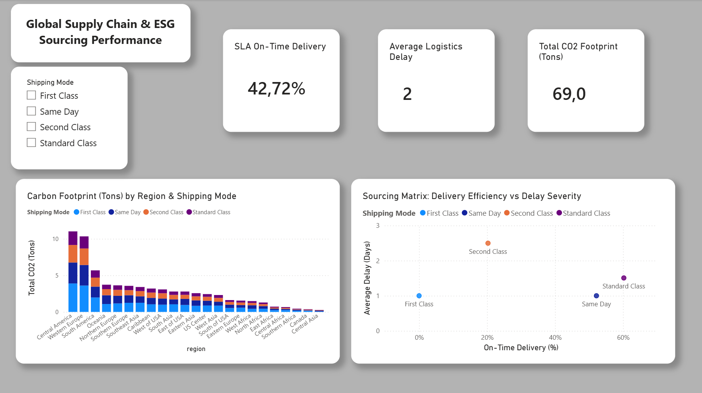

# Supply Chain & ESG Analytics

## Overview
A data processing pipeline and reporting dashboard designed to track logistics performance and environmental impact. The goal of the project was to transform raw supply chain records into actionable KPIs (delivery delays, SLA compliance, and carbon footprint) to support sourcing decisions.

## Workflow & Tools

1. **Data Extraction & Load (Python / Pandas):** 
   Extracted relevant logistics columns from the raw DataCo dataset. Optimized memory usage by defining data types and loaded the cleaned subset into a local SQLite database.

2. **Data Transformation (SQL / SQLite):** 
   Wrote queries using CTEs and JOINs to engineer key business metrics:
   * Calculated delivery delays (real vs. scheduled shipment days).
   * Flagged late deliveries.
   * Calculated CO2 emissions (in Tons) based on item quantities and shipping mode multipliers.

3. **Visualization (Power BI):** 
   Connected the transformed dataset to Power BI to build an interactive dashboard visualizing SLA On-Time Delivery rates, average delay severity, and regional carbon footprints.
   
